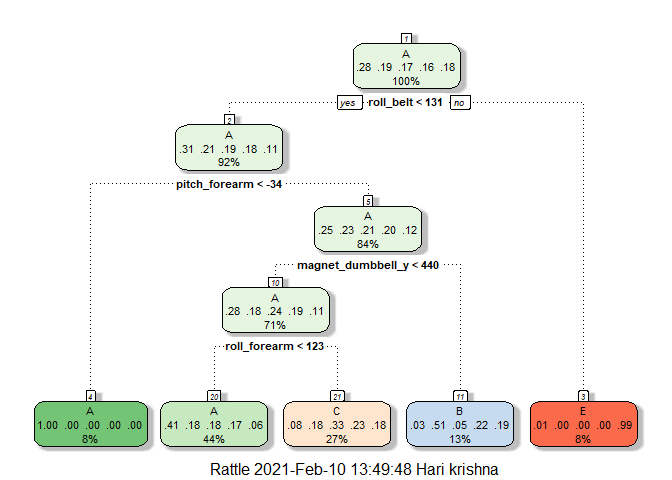
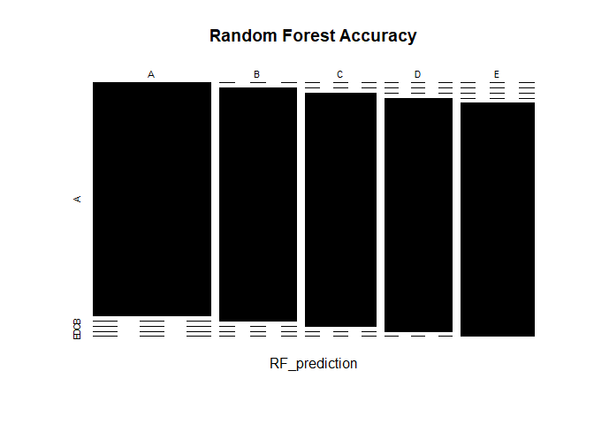

## Objective

The goal of this project assignment is to predict the manner in which they did the exercise. This is the "classe" variable in the training set. We can  use any of the other variables to predict with. We should create a report describing how we can built our model, and how can we used cross validation, think the expected out of sample error is, and why we made the choices. 

## Data Source

The training data for this project are available here:

https://d396qusza40orc.cloudfront.net/predmachlearn/pml-training.csv

The test data are available here:

https://d396qusza40orc.cloudfront.net/predmachlearn/pml-testing.csv

The data for this project come from this source: http://web.archive.org/web/20161224072740/http:/groupware.les.inf.puc-rio.br/har.

### 1) Data Load, Initialzing Variables and Data Cleaning


```r
library(knitr)
library(caret)
```

```
## Warning: package 'caret' was built under R version 4.0.3
```

```
## Loading required package: lattice
```

```
## Loading required package: ggplot2
```

```r
library(rpart)
library(rpart.plot)
```

```
## Warning: package 'rpart.plot' was built under R version 4.0.3
```

```r
library(randomForest)
```

```
## Warning: package 'randomForest' was built under R version 4.0.3
```

```
## randomForest 4.6-14
```

```
## Type rfNews() to see new features/changes/bug fixes.
```

```
## 
## Attaching package: 'randomForest'
```

```
## The following object is masked from 'package:ggplot2':
## 
##     margin
```

```r
library(corrplot)
```

```
## Warning: package 'corrplot' was built under R version 4.0.3
```

```
## corrplot 0.84 loaded
```

```r
library(e1071)
```

```
## Warning: package 'e1071' was built under R version 4.0.3
```

```r
# configuring variables to store the required URLs 
trainURL <- "http://d396qusza40orc.cloudfront.net/predmachlearn/pml-training.csv"
testURL  <- "http://d396qusza40orc.cloudfront.net/predmachlearn/pml-testing.csv"

# set datasets into variables
trainingDS <- read.csv(url(trainURL))
testingDS  <- read.csv(url(testURL))

# create a partition with the training dataset 
inTrain  <- createDataPartition(trainingDS$classe, p=0.7, list=FALSE)
trainingDS <- trainingDS[inTrain, ]
testingDS  <- trainingDS[-inTrain, ]
dim(trainingDS)
```

```
## [1] 13737   160
```

```r
dim(testingDS)
```

```
## [1] 4110  160
```

```r
# sort out by removing near Zero  values
NZValues <- nearZeroVar(trainingDS)
trainingDS <- trainingDS[, -NZValues]
testingDS  <- testingDS[, -NZValues]
dim(trainingDS)
```

```
## [1] 13737   103
```

```r
dim(testingDS)
```

```
## [1] 4110  103
```

```r
# sort out by removing  NA values
AllNA    <- sapply(trainingDS, function(x) mean(is.na(x))) > 0.95
trainingDS <- trainingDS[, AllNA==FALSE]
testingDS  <- testingDS[, AllNA==FALSE]
dim(trainingDS)
```

```
## [1] 13737    59
```

```r
dim(testingDS)
```

```
## [1] 4110   59
```

```r
# remove identification only variables (columns 1 to 5)
trainingDS <- trainingDS[, -(1:5)]
testingDS  <- testingDS[, -(1:5)]

dim(trainingDS)
```

```
## [1] 13737    54
```

```r
dim(testingDS)
```

```
## [1] 4110   54
```

### 2) Cross Validation the model


```r
# Decision Tree Model and Prediction
library(rattle)
```

```
## Warning: package 'rattle' was built under R version 4.0.3
```

```
## Loading required package: tibble
```

```
## Loading required package: bitops
```

```
## Rattle: A free graphical interface for data science with R.
## Version 5.4.0 Copyright (c) 2006-2020 Togaware Pty Ltd.
## Type 'rattle()' to shake, rattle, and roll your data.
```

```
## 
## Attaching package: 'rattle'
```

```
## The following object is masked from 'package:randomForest':
## 
##     importance
```

```r
DT_model<- train(classe ~. , data=trainingDS, method= "rpart")
fancyRpartPlot(DT_model$finalModel)
```

<!-- -->

```r
set.seed(21243)
DT_prediction<- predict(DT_model, testingDS)
confusionMatrix(table(DT_prediction, testingDS$classe))
```

```
## Confusion Matrix and Statistics
## 
##              
## DT_prediction    A    B    C    D    E
##             A 1073  333  338  307  126
##             B   20  275   25  116   87
##             C   88  180  349  260  202
##             D    0    0    0    0    0
##             E    5    0    0    0  326
## 
## Overall Statistics
##                                           
##                Accuracy : 0.4922          
##                  95% CI : (0.4768, 0.5076)
##     No Information Rate : 0.2886          
##     P-Value [Acc > NIR] : < 2.2e-16       
##                                           
##                   Kappa : 0.3343          
##                                           
##  Mcnemar's Test P-Value : NA              
## 
## Statistics by Class:
## 
##                      Class: A Class: B Class: C Class: D Class: E
## Sensitivity            0.9047  0.34898  0.49017   0.0000  0.43995
## Specificity            0.6224  0.92535  0.78517   1.0000  0.99852
## Pos Pred Value         0.4929  0.52581  0.32345      NaN  0.98489
## Neg Pred Value         0.9415  0.85698  0.88024   0.8338  0.89018
## Prevalence             0.2886  0.19173  0.17324   0.1662  0.18029
## Detection Rate         0.2611  0.06691  0.08491   0.0000  0.07932
## Detection Prevalence   0.5297  0.12725  0.26253   0.0000  0.08054
## Balanced Accuracy      0.7636  0.63717  0.63767   0.5000  0.71923
```

```r
# Random Forest Model and Prediction
set.seed(26817)
RF_model<- train(classe ~. , data=trainingDS, method= "rf", ntree=100)
RF_prediction<- predict(RF_model, testingDS)
RF_cm<-confusionMatrix(table(RF_prediction, testingDS$classe))
RF_cm
```

```
## Confusion Matrix and Statistics
## 
##              
## RF_prediction    A    B    C    D    E
##             A 1186    0    0    0    0
##             B    0  788    0    0    0
##             C    0    0  712    0    0
##             D    0    0    0  683    0
##             E    0    0    0    0  741
## 
## Overall Statistics
##                                      
##                Accuracy : 1          
##                  95% CI : (0.9991, 1)
##     No Information Rate : 0.2886     
##     P-Value [Acc > NIR] : < 2.2e-16  
##                                      
##                   Kappa : 1          
##                                      
##  Mcnemar's Test P-Value : NA         
## 
## Statistics by Class:
## 
##                      Class: A Class: B Class: C Class: D Class: E
## Sensitivity            1.0000   1.0000   1.0000   1.0000   1.0000
## Specificity            1.0000   1.0000   1.0000   1.0000   1.0000
## Pos Pred Value         1.0000   1.0000   1.0000   1.0000   1.0000
## Neg Pred Value         1.0000   1.0000   1.0000   1.0000   1.0000
## Prevalence             0.2886   0.1917   0.1732   0.1662   0.1803
## Detection Rate         0.2886   0.1917   0.1732   0.1662   0.1803
## Detection Prevalence   0.2886   0.1917   0.1732   0.1662   0.1803
## Balanced Accuracy      1.0000   1.0000   1.0000   1.0000   1.0000
```

```r
#plot the graph
plot(RF_cm$table, col=RF_cm$byClass, main="Random Forest Accuracy")
```

<!-- -->

```r
# Gradient Boosting Model and Prediction
set.seed(25621)
gbm_model<- train(classe~., data=trainingDS, method="gbm", verbose= FALSE)
gbm_model$finalmodel
```

```
## NULL
```

```r
gbm_prediction<- predict(gbm_model, testingDS)
gbm_cm<-confusionMatrix(table(gbm_prediction, testingDS$classe))
gbm_cm
```

```
## Confusion Matrix and Statistics
## 
##               
## gbm_prediction    A    B    C    D    E
##              A 1186    3    0    1    0
##              B    0  781    5    4    0
##              C    0    4  707    6    2
##              D    0    0    0  672    2
##              E    0    0    0    0  737
## 
## Overall Statistics
##                                           
##                Accuracy : 0.9934          
##                  95% CI : (0.9905, 0.9957)
##     No Information Rate : 0.2886          
##     P-Value [Acc > NIR] : < 2.2e-16       
##                                           
##                   Kappa : 0.9917          
##                                           
##  Mcnemar's Test P-Value : NA              
## 
## Statistics by Class:
## 
##                      Class: A Class: B Class: C Class: D Class: E
## Sensitivity            1.0000   0.9911   0.9930   0.9839   0.9946
## Specificity            0.9986   0.9973   0.9965   0.9994   1.0000
## Pos Pred Value         0.9966   0.9886   0.9833   0.9970   1.0000
## Neg Pred Value         1.0000   0.9979   0.9985   0.9968   0.9988
## Prevalence             0.2886   0.1917   0.1732   0.1662   0.1803
## Detection Rate         0.2886   0.1900   0.1720   0.1635   0.1793
## Detection Prevalence   0.2895   0.1922   0.1749   0.1640   0.1793
## Balanced Accuracy      0.9993   0.9942   0.9947   0.9917   0.9973
```

```r
RF_cm$overall
```

```
##       Accuracy          Kappa  AccuracyLower  AccuracyUpper   AccuracyNull 
##      1.0000000      1.0000000      0.9991029      1.0000000      0.2885645 
## AccuracyPValue  McnemarPValue 
##      0.0000000            NaN
```

```r
gbm_cm$overall
```

```
##       Accuracy          Kappa  AccuracyLower  AccuracyUpper   AccuracyNull 
##      0.9934307      0.9916813      0.9904562      0.9956664      0.2885645 
## AccuracyPValue  McnemarPValue 
##      0.0000000            NaN
```

### 3) Test data and Prediction


```r
predictTEST <- predict(RF_model, newdata=testingDS)
predictTEST
```

```
##    [1] A A A A A A A A A A A A A A A A A A A A A A A A A A A A A A A A A A A A A
##   [38] A A A A A A A A A A A A A A A A A A A A A A A A A A A A A A A A A A A A A
##   [75] A A A A A A A A A A A A A A A A A A A A A A A A A A A A A A A A A A A A A
##  [112] A A A A A A A A A A A A A A A A A A A A A A A A A A A A A A A A A A A A A
##  [149] A A A A A A A A A A A A A A A A A A A A A A A A A A A A A A A A A A A A A
##  [186] A A A A A A A A A A A A A A A A A A A A A A A A A A A A A A A A A A A A A
##  [223] A A A A A A A A A A A A A A A A A A A A A A A A A A A A A A A A A A A A A
##  [260] A A A A A A A A A A A A A A A A A A A A A A A A A A A A A A A A A A A A A
##  [297] A A A A A A A A A A A A A A A A A A A A A A A A A A A A A A A A A A A A A
##  [334] A A A A A A A A A A A A A A A A A A A A A A A A A A A A A A A A A A A A A
##  [371] A A A A A A A A A A A A A A A A A A A A A A A A A A A A A A A A A A A A A
##  [408] A A A A A A A A A A A A A A A A A A A A A A A A A A A A A A A A A A A A A
##  [445] A A A A A A A A A A A A A A A A A A A A A A A A A A A A A A A A A A A A A
##  [482] A A A A A A A A A A A A A A A A A A A A A A A A A A A A A A A A A A A A A
##  [519] A A A A A A A A A A A A A A A A A A A A A A A A A A A A A A A A A A A A A
##  [556] A A A A A A A A A A A A A A A A A A A A A A A A A A A A A A A A A A A A A
##  [593] A A A A A A A A A A A A A A A A A A A A A A A A A A A A A A A A A A A A A
##  [630] A A A A A A A A A A A A A A A A A A A A A A A A A A A A A A A A A A A A A
##  [667] A A A A A A A A A A A A A A A A A A A A A A A A A A A A A A A A A A A A A
##  [704] A A A A A A A A A A A A A A A A A A A A A A A A A A A A A A A A A A A A A
##  [741] A A A A A A A A A A A A A A A A A A A A A A A A A A A A A A A A A A A A A
##  [778] A A A A A A A A A A A A A A A A A A A A A A A A A A A A A A A A A A A A A
##  [815] A A A A A A A A A A A A A A A A A A A A A A A A A A A A A A A A A A A A A
##  [852] A A A A A A A A A A A A A A A A A A A A A A A A A A A A A A A A A A A A A
##  [889] A A A A A A A A A A A A A A A A A A A A A A A A A A A A A A A A A A A A A
##  [926] A A A A A A A A A A A A A A A A A A A A A A A A A A A A A A A A A A A A A
##  [963] A A A A A A A A A A A A A A A A A A A A A A A A A A A A A A A A A A A A A
## [1000] A A A A A A A A A A A A A A A A A A A A A A A A A A A A A A A A A A A A A
## [1037] A A A A A A A A A A A A A A A A A A A A A A A A A A A A A A A A A A A A A
## [1074] A A A A A A A A A A A A A A A A A A A A A A A A A A A A A A A A A A A A A
## [1111] A A A A A A A A A A A A A A A A A A A A A A A A A A A A A A A A A A A A A
## [1148] A A A A A A A A A A A A A A A A A A A A A A A A A A A A A A A A A A A A A
## [1185] A A B B B B B B B B B B B B B B B B B B B B B B B B B B B B B B B B B B B
## [1222] B B B B B B B B B B B B B B B B B B B B B B B B B B B B B B B B B B B B B
## [1259] B B B B B B B B B B B B B B B B B B B B B B B B B B B B B B B B B B B B B
## [1296] B B B B B B B B B B B B B B B B B B B B B B B B B B B B B B B B B B B B B
## [1333] B B B B B B B B B B B B B B B B B B B B B B B B B B B B B B B B B B B B B
## [1370] B B B B B B B B B B B B B B B B B B B B B B B B B B B B B B B B B B B B B
## [1407] B B B B B B B B B B B B B B B B B B B B B B B B B B B B B B B B B B B B B
## [1444] B B B B B B B B B B B B B B B B B B B B B B B B B B B B B B B B B B B B B
## [1481] B B B B B B B B B B B B B B B B B B B B B B B B B B B B B B B B B B B B B
## [1518] B B B B B B B B B B B B B B B B B B B B B B B B B B B B B B B B B B B B B
## [1555] B B B B B B B B B B B B B B B B B B B B B B B B B B B B B B B B B B B B B
## [1592] B B B B B B B B B B B B B B B B B B B B B B B B B B B B B B B B B B B B B
## [1629] B B B B B B B B B B B B B B B B B B B B B B B B B B B B B B B B B B B B B
## [1666] B B B B B B B B B B B B B B B B B B B B B B B B B B B B B B B B B B B B B
## [1703] B B B B B B B B B B B B B B B B B B B B B B B B B B B B B B B B B B B B B
## [1740] B B B B B B B B B B B B B B B B B B B B B B B B B B B B B B B B B B B B B
## [1777] B B B B B B B B B B B B B B B B B B B B B B B B B B B B B B B B B B B B B
## [1814] B B B B B B B B B B B B B B B B B B B B B B B B B B B B B B B B B B B B B
## [1851] B B B B B B B B B B B B B B B B B B B B B B B B B B B B B B B B B B B B B
## [1888] B B B B B B B B B B B B B B B B B B B B B B B B B B B B B B B B B B B B B
## [1925] B B B B B B B B B B B B B B B B B B B B B B B B B B B B B B B B B B B B B
## [1962] B B B B B B B B B B B B B C C C C C C C C C C C C C C C C C C C C C C C C
## [1999] C C C C C C C C C C C C C C C C C C C C C C C C C C C C C C C C C C C C C
## [2036] C C C C C C C C C C C C C C C C C C C C C C C C C C C C C C C C C C C C C
## [2073] C C C C C C C C C C C C C C C C C C C C C C C C C C C C C C C C C C C C C
## [2110] C C C C C C C C C C C C C C C C C C C C C C C C C C C C C C C C C C C C C
## [2147] C C C C C C C C C C C C C C C C C C C C C C C C C C C C C C C C C C C C C
## [2184] C C C C C C C C C C C C C C C C C C C C C C C C C C C C C C C C C C C C C
## [2221] C C C C C C C C C C C C C C C C C C C C C C C C C C C C C C C C C C C C C
## [2258] C C C C C C C C C C C C C C C C C C C C C C C C C C C C C C C C C C C C C
## [2295] C C C C C C C C C C C C C C C C C C C C C C C C C C C C C C C C C C C C C
## [2332] C C C C C C C C C C C C C C C C C C C C C C C C C C C C C C C C C C C C C
## [2369] C C C C C C C C C C C C C C C C C C C C C C C C C C C C C C C C C C C C C
## [2406] C C C C C C C C C C C C C C C C C C C C C C C C C C C C C C C C C C C C C
## [2443] C C C C C C C C C C C C C C C C C C C C C C C C C C C C C C C C C C C C C
## [2480] C C C C C C C C C C C C C C C C C C C C C C C C C C C C C C C C C C C C C
## [2517] C C C C C C C C C C C C C C C C C C C C C C C C C C C C C C C C C C C C C
## [2554] C C C C C C C C C C C C C C C C C C C C C C C C C C C C C C C C C C C C C
## [2591] C C C C C C C C C C C C C C C C C C C C C C C C C C C C C C C C C C C C C
## [2628] C C C C C C C C C C C C C C C C C C C C C C C C C C C C C C C C C C C C C
## [2665] C C C C C C C C C C C C C C C C C C C C C C D D D D D D D D D D D D D D D
## [2702] D D D D D D D D D D D D D D D D D D D D D D D D D D D D D D D D D D D D D
## [2739] D D D D D D D D D D D D D D D D D D D D D D D D D D D D D D D D D D D D D
## [2776] D D D D D D D D D D D D D D D D D D D D D D D D D D D D D D D D D D D D D
## [2813] D D D D D D D D D D D D D D D D D D D D D D D D D D D D D D D D D D D D D
## [2850] D D D D D D D D D D D D D D D D D D D D D D D D D D D D D D D D D D D D D
## [2887] D D D D D D D D D D D D D D D D D D D D D D D D D D D D D D D D D D D D D
## [2924] D D D D D D D D D D D D D D D D D D D D D D D D D D D D D D D D D D D D D
## [2961] D D D D D D D D D D D D D D D D D D D D D D D D D D D D D D D D D D D D D
## [2998] D D D D D D D D D D D D D D D D D D D D D D D D D D D D D D D D D D D D D
## [3035] D D D D D D D D D D D D D D D D D D D D D D D D D D D D D D D D D D D D D
## [3072] D D D D D D D D D D D D D D D D D D D D D D D D D D D D D D D D D D D D D
## [3109] D D D D D D D D D D D D D D D D D D D D D D D D D D D D D D D D D D D D D
## [3146] D D D D D D D D D D D D D D D D D D D D D D D D D D D D D D D D D D D D D
## [3183] D D D D D D D D D D D D D D D D D D D D D D D D D D D D D D D D D D D D D
## [3220] D D D D D D D D D D D D D D D D D D D D D D D D D D D D D D D D D D D D D
## [3257] D D D D D D D D D D D D D D D D D D D D D D D D D D D D D D D D D D D D D
## [3294] D D D D D D D D D D D D D D D D D D D D D D D D D D D D D D D D D D D D D
## [3331] D D D D D D D D D D D D D D D D D D D D D D D D D D D D D D D D D D D D D
## [3368] D D E E E E E E E E E E E E E E E E E E E E E E E E E E E E E E E E E E E
## [3405] E E E E E E E E E E E E E E E E E E E E E E E E E E E E E E E E E E E E E
## [3442] E E E E E E E E E E E E E E E E E E E E E E E E E E E E E E E E E E E E E
## [3479] E E E E E E E E E E E E E E E E E E E E E E E E E E E E E E E E E E E E E
## [3516] E E E E E E E E E E E E E E E E E E E E E E E E E E E E E E E E E E E E E
## [3553] E E E E E E E E E E E E E E E E E E E E E E E E E E E E E E E E E E E E E
## [3590] E E E E E E E E E E E E E E E E E E E E E E E E E E E E E E E E E E E E E
## [3627] E E E E E E E E E E E E E E E E E E E E E E E E E E E E E E E E E E E E E
## [3664] E E E E E E E E E E E E E E E E E E E E E E E E E E E E E E E E E E E E E
## [3701] E E E E E E E E E E E E E E E E E E E E E E E E E E E E E E E E E E E E E
## [3738] E E E E E E E E E E E E E E E E E E E E E E E E E E E E E E E E E E E E E
## [3775] E E E E E E E E E E E E E E E E E E E E E E E E E E E E E E E E E E E E E
## [3812] E E E E E E E E E E E E E E E E E E E E E E E E E E E E E E E E E E E E E
## [3849] E E E E E E E E E E E E E E E E E E E E E E E E E E E E E E E E E E E E E
## [3886] E E E E E E E E E E E E E E E E E E E E E E E E E E E E E E E E E E E E E
## [3923] E E E E E E E E E E E E E E E E E E E E E E E E E E E E E E E E E E E E E
## [3960] E E E E E E E E E E E E E E E E E E E E E E E E E E E E E E E E E E E E E
## [3997] E E E E E E E E E E E E E E E E E E E E E E E E E E E E E E E E E E E E E
## [4034] E E E E E E E E E E E E E E E E E E E E E E E E E E E E E E E E E E E E E
## [4071] E E E E E E E E E E E E E E E E E E E E E E E E E E E E E E E E E E E E E
## [4108] E E E
## Levels: A B C D E
```

### 4) Conclusion

Random Forest model is more accurate than Gradient Boosting Model about 99% of accuracy level. 
